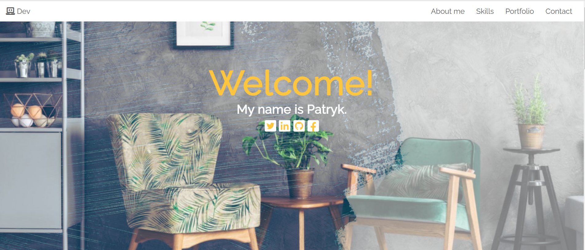
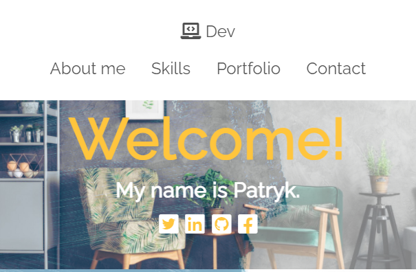

# Portfolio Patryk Budnicki wykonane używając jedynie HTML oraz CSS

Zobacz na żywo wersję strony z gałęzi main:\
https://budnickip.github.io/CodersCamp2020.Project.HTML-CSS.BusinessCard/ \

Zobacz na żywo wersję strony z gałęzi dev-branch:\
https://affectionate-keller-e16e10.netlify.app/

##### W projekcie została zaprezentowana praktyczna znajomość poniższych zagadnień związanych z HTML & CSS:
- Box-model
- Kaskadowość CSS
- Selektory CSS
- Popularne tagi HTML
- Jak podpinać CSSa do HTMLa
- Zapisywanie kolorów
- Stylowanie tekstu
- Zewnętrzne ikony/fonty (fontawesome, google fonts)
- Flexbox i/lub CSS Grid
- Position (absolute, relative)
- Animacje keyframes
- Formularz (wysłanie formularza może powodować przeładowanie strony, gdyż w kursie nie było jeszcze jego obsługi)
- Responsive Web Design

Javascript został jedynie użyty do zaimportowania czcionek z fontawesome
Nie zostały użyte gotowe biblioteki styli, takie jak bootsrap
Nie został użyty żaden framework.
  

### Opis projektu

Projekt został stworzony na podstawie opracowanego przez CodersCamp projektu:
https://www.figma.com/file/WHtiMfcNHt4tc7mDamNBYa/CodersCamp2020-Wizytowka?node-id=0%3A1

#### Menu oraz Header

Menu oraz nagłówek zostało dostosowane pod urządzenia desktopowe jak i mobilne.
Dzięki wykorzystaniu flexboxa wszystkie pozycje menu są czytelne na każdym dowolnym urządzeniu.
Menu na dużych rozdzielczościach podąża za oknem przeglądarki dzięki position: fixed

Menu na mniejszych rozdzielczościach(dla telefonów oraz tabletów) nie podąża za oknem przeglądarki, aby nie zasłaniać widoku strony.\
\

Aby ułatwić prezentację projektu innym osobom, dobrze, gdyby był on dostępny bez problemów pod adresem strony internetowej.
W tym przypadku większość pracy z tym związanej zrobiliśmy już za Ciebie. 
Oto co musisz zrobić, żeby zobaczyć efekt i zacząć development:

1. Wykonaj fork tego repozytorium do swojego własnego profilu. 
Po kliknięciu przycisku pokazanego poniżej GitHub przeniesie Cię automatycznie na Twoją kopię tego repozytorium.
To tutaj będziesz wykonywać swoją stronę.

1. Przejdź do zakładki Settings w Twoim repozytorium.

1. Znajdź w zakładce setting sekcję GitHub Pages i wybierz branch *main* jako source (na screenie dawna nazwa głównej gałęzi - master).

1. Po wyborze brancha *main*, zatwierdź ustawienia, klikając przycisk `Save`. 
Wszystko powinno wyglądać tak jak w czerwonym polu poniżej.
Dzięki temu aktywujesz GitHub Pages dla swojego repozytorium.

1. Znajdź sekcję GitHub Pages w zakładce Setting jeszcze raz.
Teraz powinien znajdować się w tym miejscu link. Po kliknięciu zaprowadzi Cię do Twojej strony.
Ten link możesz przekazać teraz kolegom z zespołu i mentorowi. 
Będą mogli dać Ci cenne wskazówki i pomóc z błędami bez pobierania całego repozytorium.
A Twoja strona jest od razu dostępna w internecie dla każdego, kto chciałby ją odwiedzić. I to kompletnie za darmo!

1. Jeśli po kliknięciu w link, pokazała Ci się strona o tej treści, to znaczy, że wszystko jest w porządku.

Od teraz każda zmiana, jaką commitujesz do głównego brancha, będzie się pokazywać pod tym adresem.
Masz już działające środowisko, więc na co czekasz? Do dzieła!

### Porady odnośnie do projektu

#### Interfejs
Możesz posłużyć się projektem interfejsu strony — wizytówki, wykonanym przez organizatorów projektu. 
Jest to tylko dla ułatwienia Ci pracy.
Możesz w trakcie implementacji go dowolnie przekształcać / zmieniać czy zrobić coś zupełnie innego.
https://www.figma.com/file/WHtiMfcNHt4tc7mDamNBYa/CodersCamp2020-Wizytowka?node-id=0%3A1
Pamiętaj też, że Twoje rozwiązanie musi być responsywne! 
Czyli odpowiednio dostosowywać sposób wyświetlania treści do rozmiaru okna przeglądarki.

Inspiracją może być także [DevChallenge.io - Portfolio](https://devchallenges.io/challenges/5ZnOYsSXM24JWnCsNFlt). 
Pamiętaj tylko, że Ty korzystasz tutaj jedynie z HTML i CSS.

Przygotowane projekty interfejsu użytkownika są tutaj po to, żebyś bez problemów postawił swoje pierwsze kroki w praktycznym wykorzystaniu HTML i CSS.
Jednakże zachęcamy do wykonania czegoś, co ukaże Twoje wnętrze :) 
Dobrej zabawy!
