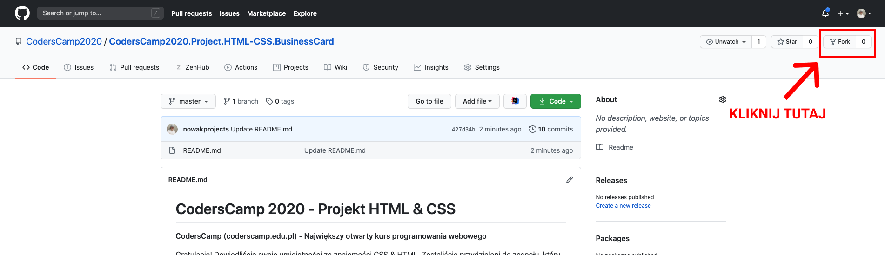
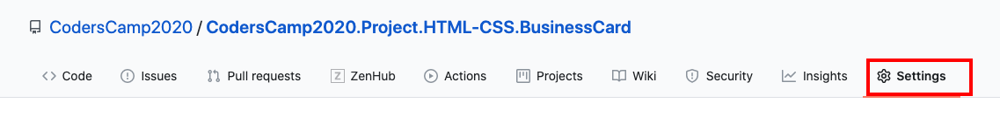
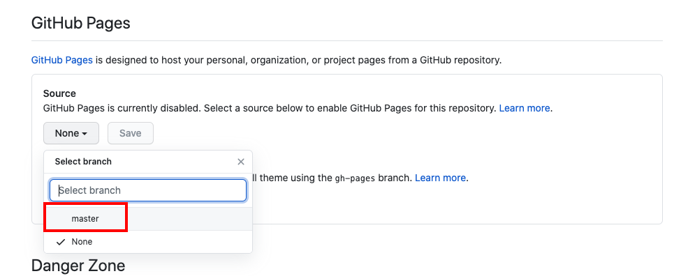
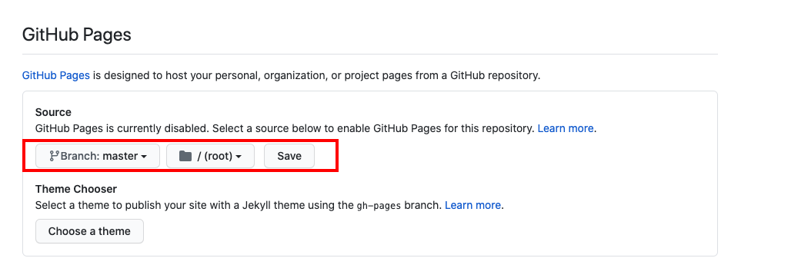
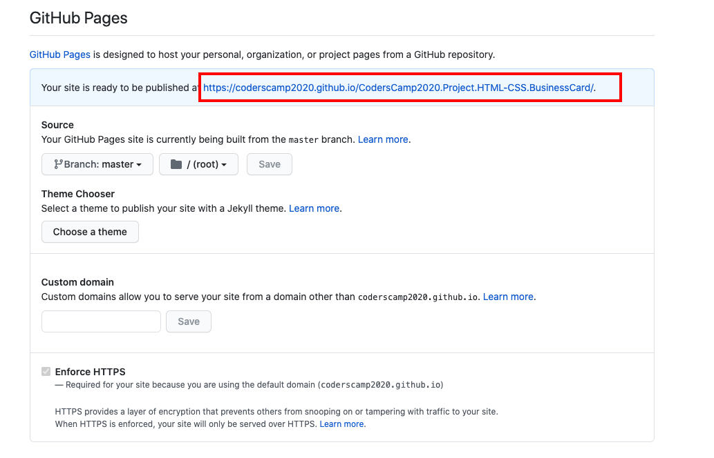
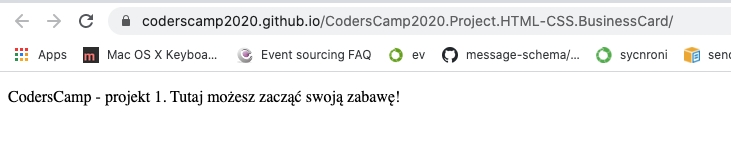

# CodersCamp 2020 - Projekt HTML & CSS
**CodersCamp (coderscamp.edu.pl) - Największy otwarty kurs programowania webowego** 

Gratulacje! 
Skoro czytacie ten tekst, oznacza to, że dowiedliście swoich umiejętności ze znajomości HTML & CSS. 
Zostaliście przydzieleni do zespołu, który będzie się uczył programowania i wykonywał prawdziwe aplikacje webowe.
Teraz stajecie przed pierwszym większym wyzwaniem. 
Technologie, o których się uczyliście, trzeba zastosować w praktyce.
To pierwszy i ostatni na CodersCamp projekt, który będziecie robić w pojedynkę.
Jednakże już macie cały zespół i mentora, który z pewnością będzie Was wspierał.

## Projekt HTML & CSS — Wizytówka / Portfolio

### Zasady wykonywania projektu (wspólne dla wszystkich grup i mentorów): 

##### W projekcie każdy z uczestników powinien zaprezentować praktyczną znajomość poniższych zagadnień związanych z HTML & CSS:
- Box-model
- Kaskadowość CSS
- Selektory CSS
- Popularne tagi HTML
- Jak podpinać CSSa do HTMLa
- Zapisywanie kolorów
- Stylowanie tekstu
- Zewnętrzne ikony/fonty (fontawesome, google fonts)
- Flexbox i/lub CSS Grid
- Position (absolute, relative)
- Animacje keyframes
- Formularz (wysłanie formularza może powodować przeładowanie strony, gdyż w kursie nie było jeszcze jego obsługi)
- Responsive Web Design

Nie używaj JavaScriptu ani żadnego innego frameworka. 
Nie używaj też gotowych bibliotek styli takich jak Bootstrap. 
W trakcie przerabiania działu poznałeś wszystkie umiejętności, które pozwolą Ci wykonać Twoją wizytówkę od podstaw :) 

##### Sposób oceny projektu (dotyczy tylko projektu pierwszego):
Zapewne interesuje Was, w jaki sposób projekt zostanie „zaliczony” i oceniony.
Ocenianie będzie miało kilka etapów.

- Kiedy skończycie pracę nad projektem, odnotujcie ten fakt w specjalnie przygotowanym formularzu — link otrzymacie od swojego mentora.
Powinno to nastąpić najpóźniej o godzinie 23:59 dnia poprzedzającego prezentację projektu (data dostępna w harmonogramie kursu).
- Spotkajcie się w wyznaczonym dniu całym zespołem wraz z mentorem (np. za pomocą Google Meet). W trakcie spotkania zaprezentujcie wykonane przez Was projekty.
Forma prezentacji pozostaje dowolna (musi zmieścić się w 5 minutach + 5 minut na pytania). 
Możecie przygotować jakieś slajdy, pokaz waszych talentów, czy nawet zaśpiewać — ale nie jest to konieczne. Na pewno musi zostać pokazana działająca strona internetowa, reszta wg Waszego uznania. 
Jeśli robicie wizytówkę o sobie, to być może chcecie też opowiedzieć o swoich zainteresowaniach, żeby inni w zespole poznali Was lepiej :) ? 
- Po prezentacji mentor Waszego zespołu oceni projekt wg kryteriów opisanych w specjalnym arkuszu — przykład takiego arkusza możecie zobaczyć [TUTAJ](https://docs.google.com/spreadsheets/d/1mjCi-oDXILKoCReqJlhGYP4NW-HVMCzvdcIy6ntnsog/edit?usp=sharing). 
Pamiętajcie też odpowiednio opracować README.md Waszego projektu, tak aby prezentowało kto, co, jak i dlaczego zostało wykonane.
Zawartość, którą macie tutaj aktualnie (to co teraz czytacie) można usunąć — znajdziecie ją zawsze w oryginalnym repozytorium, które forkowaliście.
- Po zrecenzowaniu waszych projektów mentor powinien przekazać każdemu jego ocenę punktową i feedback jako uzasadnienie.     

### Opis projektu
Pozyskanie pierwszego klienta nie przychodzi łatwo. 
Dla klienta, który chce otrzymać produkt wysokiej jakości, nie jest ważna tylko firma, która spróbuje zrealizować jego wizję. 
Równie istotne jest też to, z jakimi konkretnymi osobami przyjdzie komuś współpracować przy wytwarzaniu oprogramowania.
Dobrze, żeby Wasi przyszli klienci i wasz zespół trochę lepiej Was poznali.
Dlatego jako pierwszy projekt do Waszego portfolio proponujemy przygotowanie strony — wizytówki.
Motywem przewodnim powinniście być właśnie Wy sami lub o wasze zrealizowane projekty lub zainteresowania, najważniejsze umiejętności — nie koniecznie programistycznych! 
Jesteś fotografem? Możesz przygotować stronę reklamującą swoje usługi. 
Jako fryzjer czy mechanik, możesz zrobić podobnie. 
Świat web designu stoi przed Tobą otworem. 

W tym pierwszym, rozgrzewkowym projekcie pracujecie jeszcze osobno. 
Pamiętajcie, że macie zespół i mentora, który jest tutaj, żeby Was wspierać przez cały czas trwania kursu. 

Dajcie się lepiej poznać dzięki internetowi i swoim umiejętnością! :) 

#### Jak rozpocząć pracę nad projektem
Aby ułatwić prezentację projektu innym osobom, dobrze, gdyby był on dostępny bez problemów pod adresem strony internetowej.
W tym przypadku większość pracy z tym związanej zrobiliśmy już za Ciebie. 
Oto co musisz zrobić, żeby zobaczyć efekt i zacząć development:

1. Wykonaj fork tego repozytorium do swojego własnego profilu. 
Po kliknięciu przycisku pokazanego poniżej GitHub przeniesie Cię automatycznie na Twoją kopię tego repozytorium.
To tutaj będziesz wykonywać swoją stronę.

1. Przejdź do zakładki Settings w Twoim repozytorium.

1. Znajdź w zakładce setting sekcję GitHub Pages i wybierz branch *main* jako source (na screenie dawna nazwa głównej gałęzi - master).

1. Po wyborze brancha *main*, zatwierdź ustawienia, klikając przycisk `Save`. 
Wszystko powinno wyglądać tak jak w czerwonym polu poniżej.
Dzięki temu aktywujesz GitHub Pages dla swojego repozytorium.

1. Znajdź sekcję GitHub Pages w zakładce Setting jeszcze raz.
Teraz powinien znajdować się w tym miejscu link. Po kliknięciu zaprowadzi Cię do Twojej strony.
Ten link możesz przekazać teraz kolegom z zespołu i mentorowi. 
Będą mogli dać Ci cenne wskazówki i pomóc z błędami bez pobierania całego repozytorium.
A Twoja strona jest od razu dostępna w internecie dla każdego, kto chciałby ją odwiedzić. I to kompletnie za darmo!

1. Jeśli po kliknięciu w link, pokazała Ci się strona o tej treści, to znaczy, że wszystko jest w porządku.

Od teraz każda zmiana, jaką commitujesz do głównego brancha, będzie się pokazywać pod tym adresem.
Masz już działające środowisko, więc na co czekasz? Do dzieła!

### Porady odnośnie do projektu

#### Interfejs
Możesz posłużyć się projektem interfejsu strony — wizytówki, wykonanym przez organizatorów projektu. 
Jest to tylko dla ułatwienia Ci pracy.
Możesz w trakcie implementacji go dowolnie przekształcać / zmieniać czy zrobić coś zupełnie innego.
https://www.figma.com/file/WHtiMfcNHt4tc7mDamNBYa/CodersCamp2020-Wizytowka?node-id=0%3A1
Pamiętaj też, że Twoje rozwiązanie musi być responsywne! 
Czyli odpowiednio dostosowywać sposób wyświetlania treści do rozmiaru okna przeglądarki.

Inspiracją może być także [DevChallenge.io - Portfolio](https://devchallenges.io/challenges/5ZnOYsSXM24JWnCsNFlt). 
Pamiętaj tylko, że Ty korzystasz tutaj jedynie z HTML i CSS.

Przygotowane projekty interfejsu użytkownika są tutaj po to, żebyś bez problemów postawił swoje pierwsze kroki w praktycznym wykorzystaniu HTML i CSS.
Jednakże zachęcamy do wykonania czegoś, co ukaże Twoje wnętrze :) 
Dobrej zabawy!
