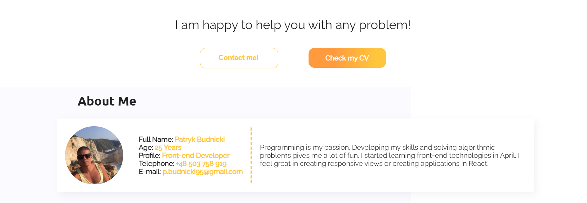
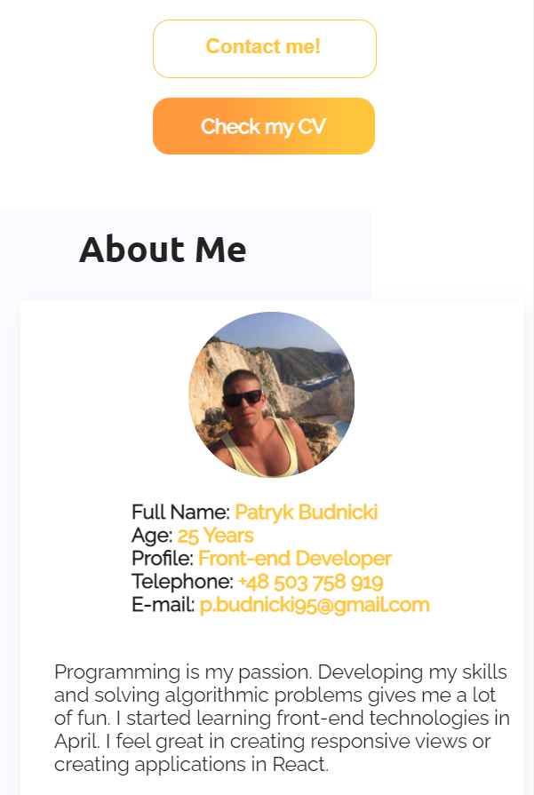
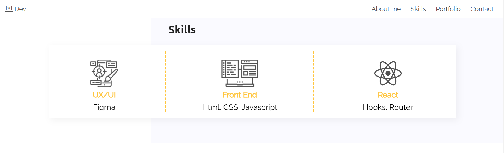
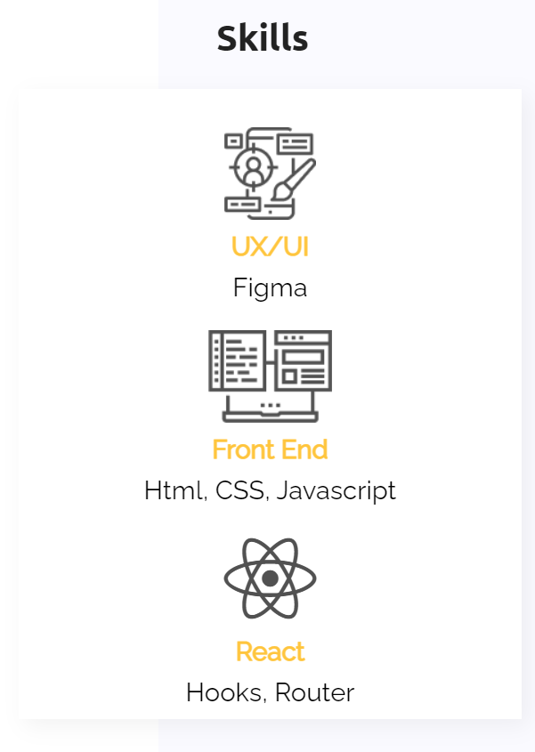
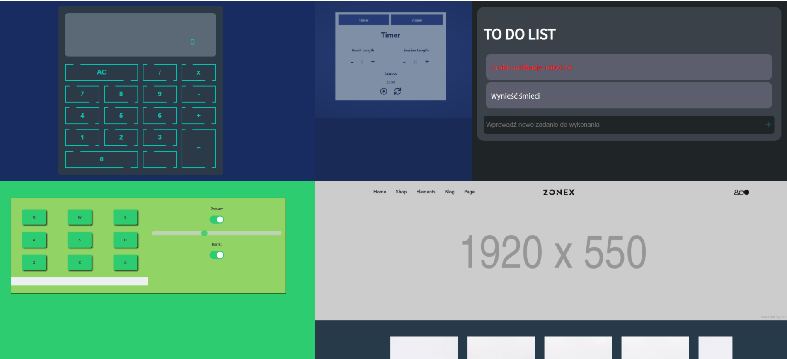
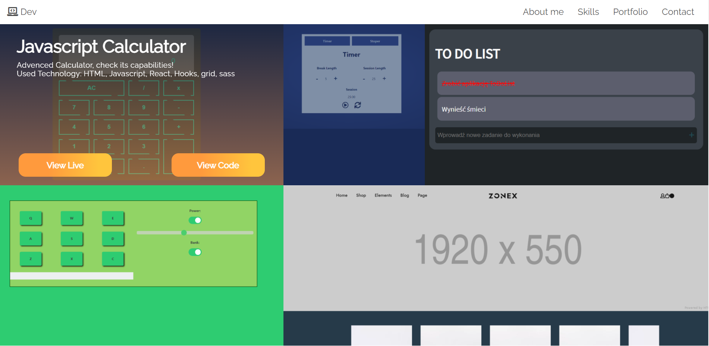
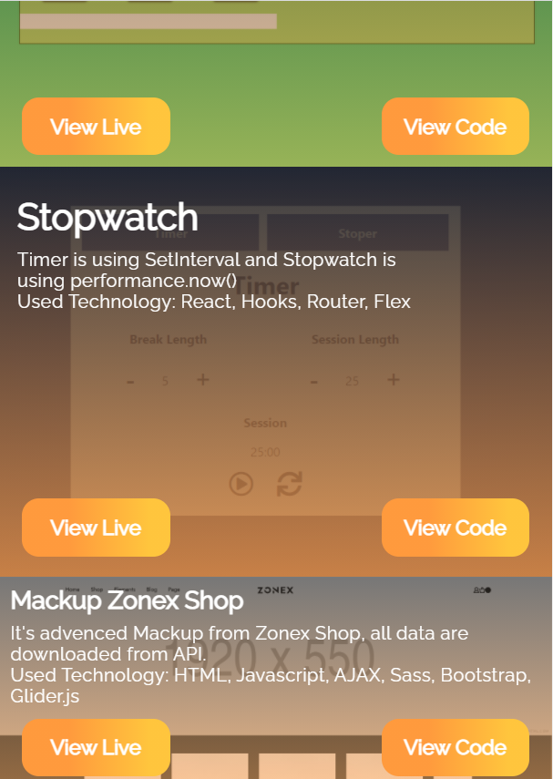
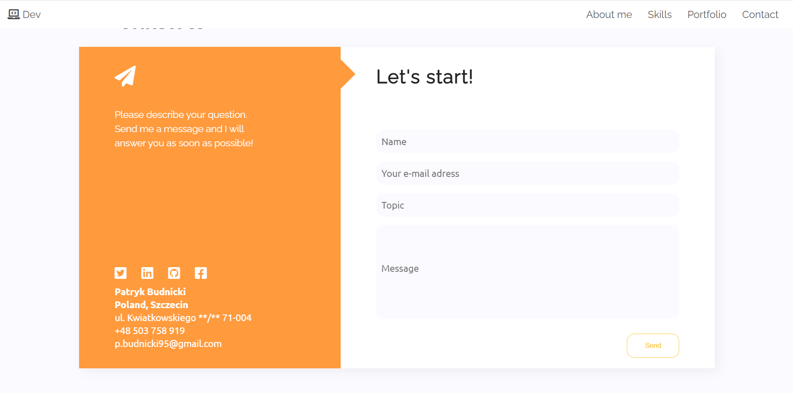
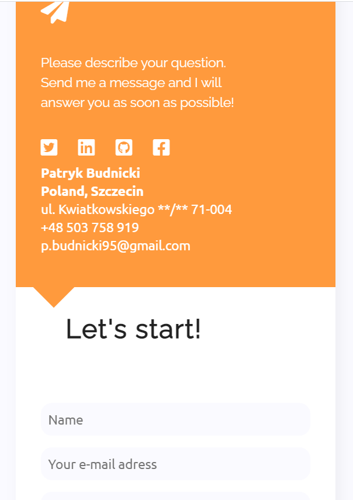

# Portfolio Patryk Budnicki wykonane używając jedynie HTML oraz CSS

Zobacz na żywo wersję strony z gałęzi main:\
https://budnickip.github.io/CodersCamp2020.Project.HTML-CSS.BusinessCard/ \

Zobacz na żywo wersję strony z gałęzi dev-branch:\
https://affectionate-keller-e16e10.netlify.app/

##### W projekcie została zaprezentowana praktyczna znajomość poniższych zagadnień związanych z HTML & CSS:
- Box-model
- Kaskadowość CSS
- Selektory CSS
- Popularne tagi HTML
- Jak podpinać CSSa do HTMLa
- Zapisywanie kolorów
- Stylowanie tekstu
- Zewnętrzne ikony/fonty (fontawesome, google fonts)
- Flexbox i/lub CSS Grid
- Position (absolute, relative)
- Animacje keyframes
- Formularz (wysłanie formularza może powodować przeładowanie strony, gdyż w kursie nie było jeszcze jego obsługi)
- Responsive Web Design

Javascript został jedynie użyty do zaimportowania czcionek z fontawesome
Nie zostały użyte gotowe biblioteki styli, takie jak bootsrap
Nie został użyty żaden framework.
  

### Opis projektu

Projekt został stworzony na podstawie opracowanego przez CodersCamp projektu:
https://www.figma.com/file/WHtiMfcNHt4tc7mDamNBYa/CodersCamp2020-Wizytowka?node-id=0%3A1 \

Cały kod projektu został oparty na metodologii BEM w celu przejrzystego czytania kodu oraz stylów.
Jedynym wnioskiem podczas tworzenia projektu używając tylko css'a, stwierdziłem, że jest to dosyć uciążliwe i zdecydowanie łatwiej
korzystać z tej metodologii wykorzystując scss.

#### Menu oraz Header

Menu oraz nagłówek zostało dostosowane pod urządzenia desktopowe jak i mobilne.
Dzięki wykorzystaniu flexboxa wszystkie pozycje menu są czytelne na każdym dowolnym urządzeniu.
Menu na dużych rozdzielczościach podąża za oknem przeglądarki dzięki position: fixed

Menu na mniejszych rozdzielczościach(dla telefonów oraz tabletów) nie podąża za oknem przeglądarki, aby nie zasłaniać widoku strony.\
\

Dodatkowo w Headerze została wykorzystana animacja, która animuje napis "My name is Patryk" przy przeładowaniu strony.\
Małym wyzwaniem było ustawienie odpowiedniej animacji za pomocą transition na ikonach pobranych z fontawesome w headerze, ponieważ domyślnie
nie miały one pomarańczowego tła(były przezroczyste).\

#### Buttony oraz sekcja About me

Przy przyciskach ciężko było wymyślić sposób na animacje gradientu - gradient nie podlega animacji, a więc, żeby zrobić "udawaną" animację
gradientu, nadałem na przycisk za pomocą pseudoklas dodatkową warstwę, która miała białe tło oraz przezroczystość ustawioną na 0, a kiedy użytkownik najechał na przycisk myszką to przezroczystość zwiększała się płynnie do 1, dzięki czemu został uzyskany płynny efekt animacji.

W sekcji About me musiałem wykorzystać position: relative do ustawienia odpowiednio tła oraz białego diva, w którym zostały zawarte wszystkie
moje informacje. To rozwiązanie zostało również zastosowane w sekcji Skills.\

Widok desktopowy:\

Widok mobilny:\

#### Sekcja Skills

W sekcji skills zostały wykorzystane ikony ikony fontawesome i ikony pobrane z projektu opracowanego przez CodersCamp\

Widok desktopowy:\

Widok mobilny:\

#### Sekcja Portfolio

Jest to sekcja, która najmniej mi się podoba, jest to prawdopodobnie spowodowane tym, że projekty które przedstawiam w swoim portfolio
mają brzydkie kolory, przez co psują wygląd strony. Sekcja ta na widoku desktopowym została stworzona z wykorzystaniem siatki grid,
zaś widok mobilny jest już oparty o flex. Dodatkowo do wyświetlania dodatkowych informacji o danym projekcie, została wykorzystana opcja
position absolute i relative.\

Widok desktopowy:\

Widok desktopowy z podświetlonym elementem:\

Na widoku mobilnym opcja hover działa według mnie średnio(na iphone w ogóle nie chciała się uruchomić), dlatego każdy projekt z portfolio
posiada od razu szczegółowe informacje na jego temat. Gdybym mógł używać javascripta, z chęcią skorzystałbym z biblioteki Glider.js
do stworzenia ładniej przewijanych projektów w portfolio.\

#### Sekcja Contact

W sekcji kontakt przedstawione są informacje o adresie oraz formularz kontaktowy. Elementem ozdobnym jest kwadrat obrócony o 90 stopni,
który na widoku desktopowym wskazuje w prawą stronę na formularz kontaktowy, a na widoku mobilnym przenosi się na dół pomarańczowego diva
i w dalszym ciągu wskazuje na formularz kontaktowy, który zawija się pod spód, aby był bardziej czytelny.\

Widok desktopowy:\
 

Widok mobilny:\
 